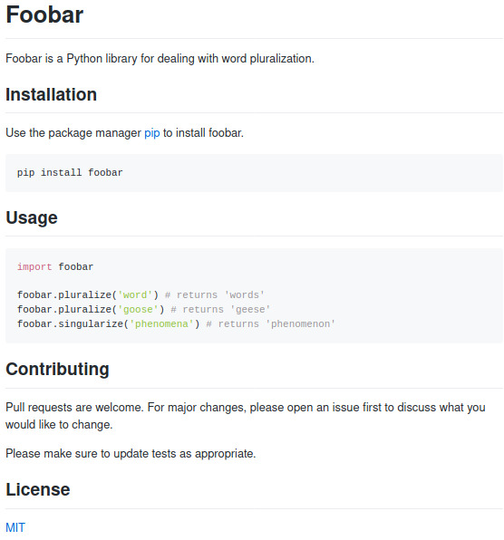

# Foobar 
Foobar is a Python lubrary for dealing with word pluraization 

## Installation

Use the package manager [pip](www.google.com/pipPackageForPython) to install foobar.

pip install foobar

## Usage 
```
    import foobar
    foobar.pluralize('word') # returns 'words'
    foobar.pluralize('goose') # returns 'geese'
    foobar.singularize('phenomena') # returns 'phenomenon'
```


## Contributing

Pull requests are welcome. For major changes. please open an issue first to discuss would like to change 

Please make sure to update tests as appropriate

## License 
[MIT](www.google.com/MIT)

